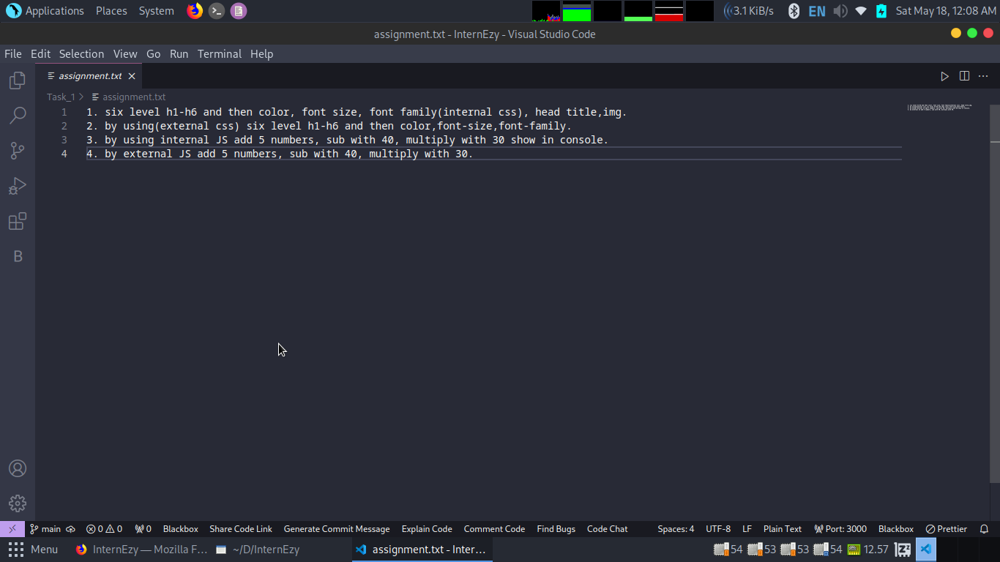
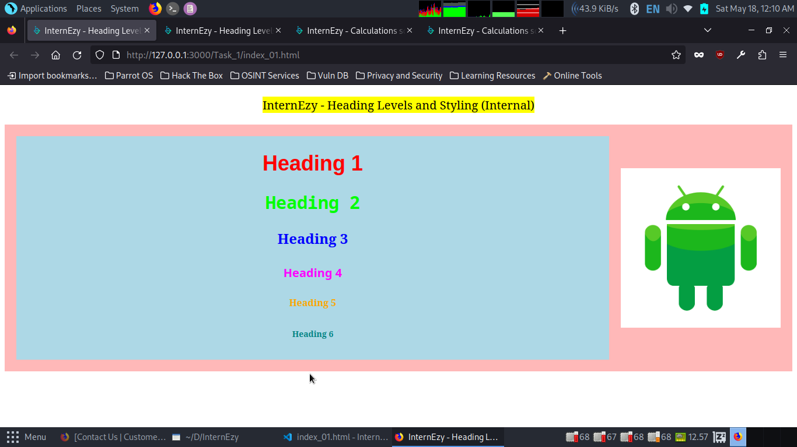
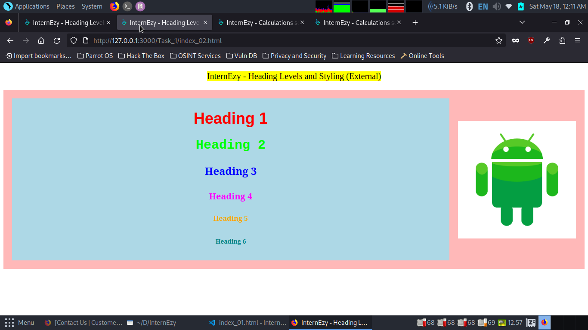
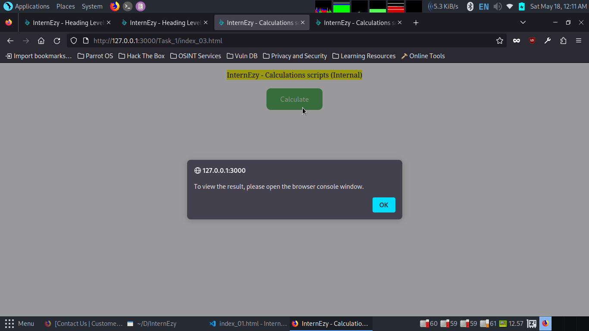
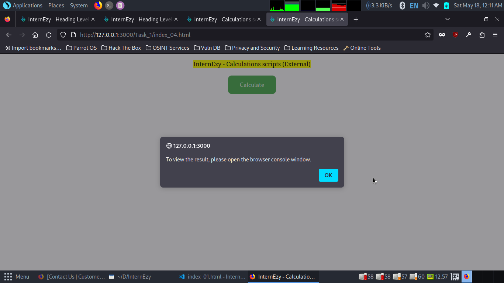
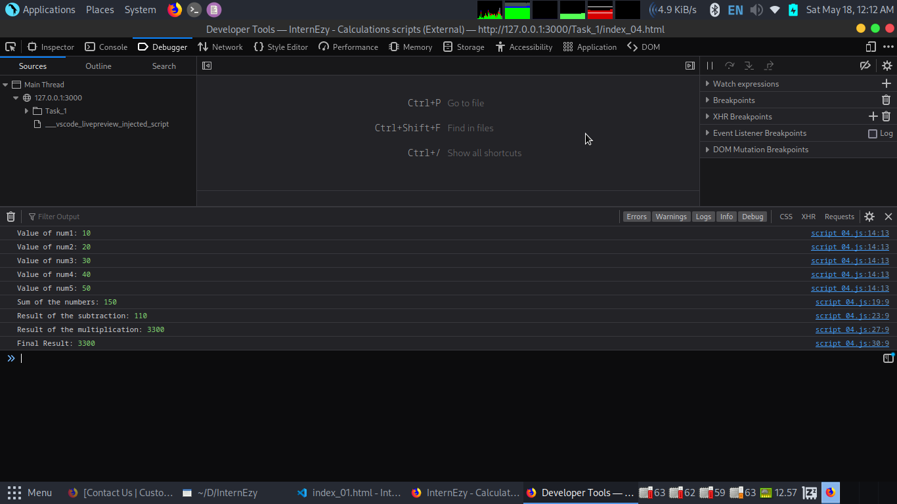

# 🌟 Task 1: HTML, CSS, and JavaScript Exercises

  

Welcome to the Task 1 repository! Here, you'll find solutions to HTML, CSS, and JavaScript exercises. Let's dive in! 🚀

## 🎨 Task Descriptions

### 💻 Task 1: Internal CSS Styling (index_1.html)

In this task, we explore internal CSS styling by beautifying six levels of headings (h1 to h6) with vibrant colors, varying font sizes, and playful font families.

### 🎨 Task 2: External CSS Styling (index_2.html)

Task 2 takes our styling skills further with external CSS. We apply delightful colors, whimsical font sizes, and charming font families to six levels of headings (h1 to h6).

### 🔢 Task 3: Internal JavaScript Operations (index_3.html)

Get ready to crunch some numbers! Task 3 showcases the power of internal JavaScript by performing arithmetic operations (addition, subtraction, multiplication) on five numbers. The results are displayed in the browser console.

### 📝 Task 4: External JavaScript Operations (index_4.html)

In Task 4, we take our number-crunching skills to the next level with external JavaScript. Similar to Task 3, we perform arithmetic operations (addition, subtraction, multiplication) on five numbers, but this time, using an external JavaScript file.

## 🖼️ Outputs

Explore the visual outputs of each HTML file:

