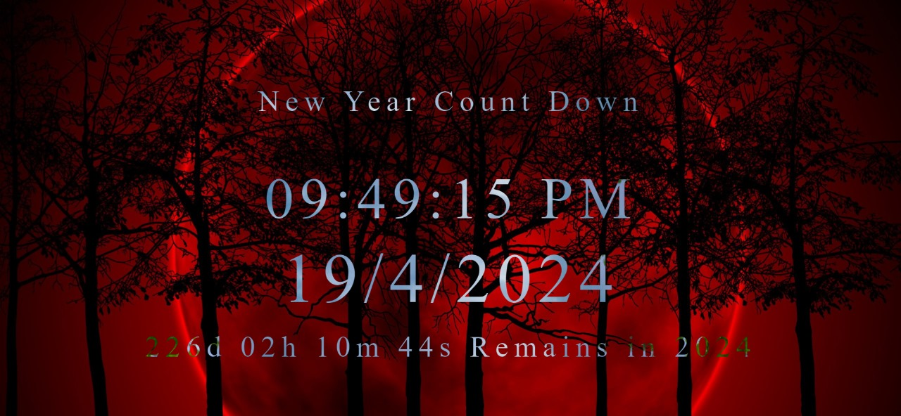

# 🌟 Task 1: HTML, CSS, and JavaScript Exercises

  

Welcome to the Task 2 repository! Here, you'll find solutions to HTML, CSS, and JavaScript exercises. Let's dive in! 🚀

## 🎨 Task Descriptions

### 📝 Task 1: New Year CountDown (index.html)

In Task 4, we take our number-crunching skills to the next level with external JavaScript. Similar to Task 3, we perform arithmetic operations (addition, subtraction, multiplication) on five numbers, but this time, using an external JavaScript file.

## 🖼️ Outputs

Explore the visual outputs of each HTML file:

  
  
Task 1: Internal CSS Styling (index_01.html)

   
  
  
Task 2: External CSS Styling (index_02.html)

   
  
  
Task 3: Internal JavaScript Operations (index_03.html)

   
  
  
Task 4: External JavaScript Operations (index_04.html)

   
  
  
Console Outputs of Task 3 and 4

