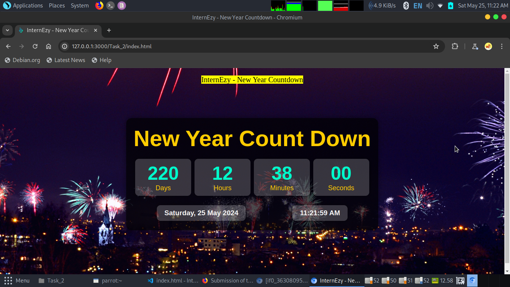

# 🌟 Task 1: HTML, CSS, and JavaScript Exercises

  

Welcome to the Task 2 repository! Here, you'll find solutions to HTML, CSS, and JavaScript exercises. Let's dive in! 🚀

## 🎨 Task Descriptions

### 📝 Task 1: New Year CountDown (index.html)

In Task 1, you'll find the solution for creating a New Year Countdown webpage. This HTML file utilizes CSS for styling and JavaScript for dynamic countdown functionality. It displays the remaining days, hours, minutes, and seconds until the next New Year's Day.

## 🖼️ Outputs

Explore the visual outputs of each HTML file:

  
  
Task 1: New Year Count Down (index.html)

